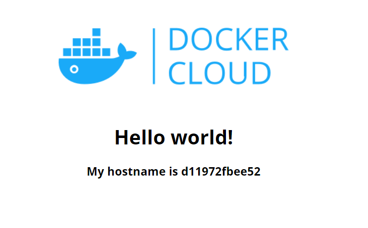
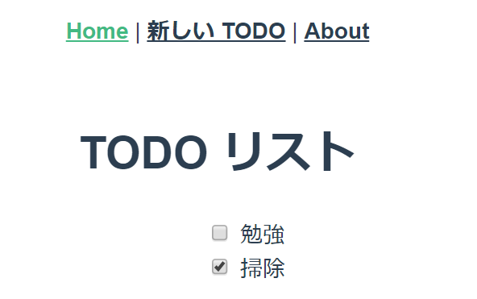
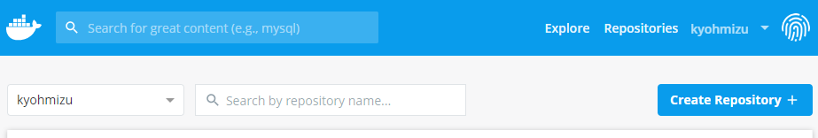
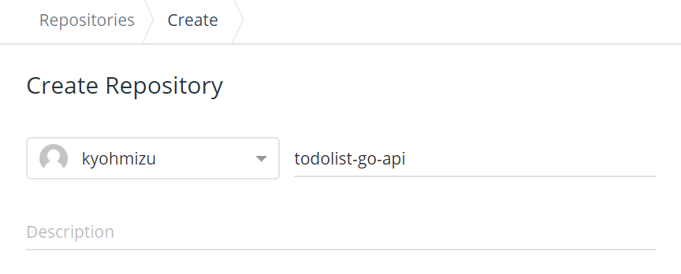
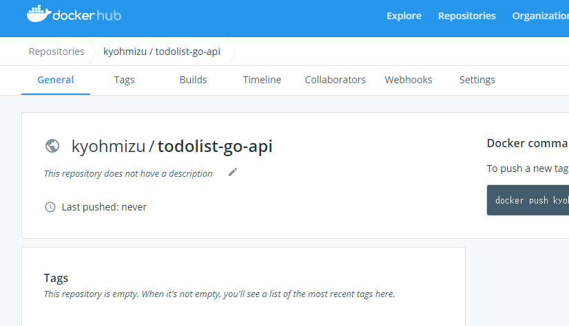
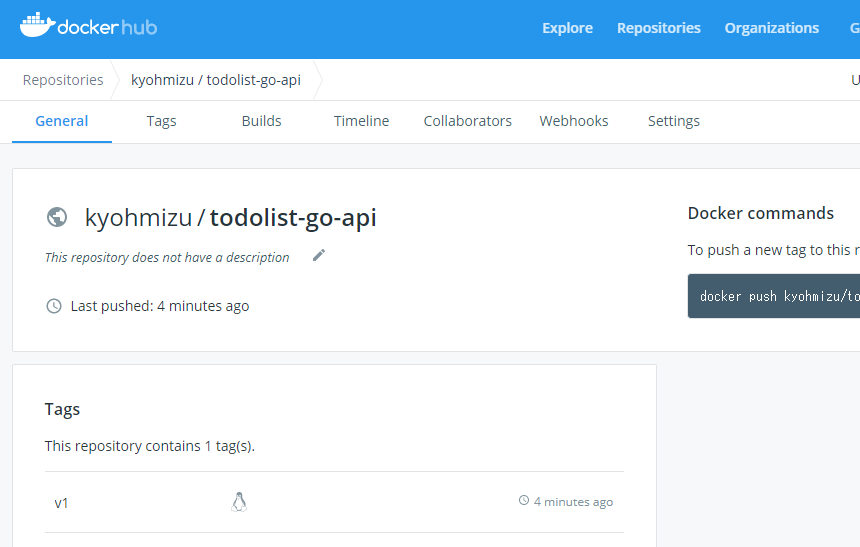

class: center, middle, inverse
## Dockerワークショップ

---
exclude: true
### whoami

.left-small[
    
]

.right-large[
- Kyohei Mizumoto(@kyohmizu)

- C# Software Engineer

- Interests
    - Docker/Kubernetes
    - Go
    - Security
]

---
### 対象者

- コンテナについて知らない人
- Dockerを触ったことがない人
- Dockerをアプリケーション開発に使用したい人

---
### 今日のゴール

- Dockerの基本的な仕組みを理解する
- Dockerコマンドを使えるようになる
- Dockerfileを書けるようになる
- Dockerを使用した開発環境の作成方法を知る

---
### アウトライン

1. 事前準備
2. コンテナの基本
3. Docker概要
4. ハンズオン
   1. Dockerの基本操作
   2. Dockerfile
   3. Dockerイメージの管理
5. 応用編

---
class: center, middle, blue
## 事前準備

---
### 実行環境

.zoom2[
Docker CEをインストールしたマシンが必要です

```bash
$ sudo docker version
```

サポートOS  
<u><https://docs.docker.com/install/#supported-platforms/></u>


Azure仮想マシン(Ubuntu)でDockerを始めるには、以下を参考にしてください  
<u><https://qiita.com/kyohmizu/items/7bc0bec96cc4664473eb></u>
]

---
### ツール等

.tmp[
- git
  - サンプルコードのインストール用  
    <u><https://git-scm.com/></u>
]
.tmp[
- ssh  
  - 仮想マシンに接続する場合は必須
  - gitをインストールしていればGit Bashで使用可
]
- Docker Hubのアカウント作成  
  <u><https://hub.docker.com/></u>

---
class: center, middle, blue
## コンテナの基本

---
### コンテナ？

- 仮想化技術の一つ(コンテナ型仮想化)  
  ⇔ 仮想マシン(VM)
- 1つのホスト上に複数の分離空間(=コンテナ)を作成
  - ホストのプロセスとして動作
  - それぞれのコンテナでは異なるOSを実行可能
- ホストOSのカーネルを共有
- Dockerコンテナが主流

---
.left-half[
  仮想マシン
  
]

.right-half[
  コンテナ
  
]

.zoom0-r[
  <u><https://docs.microsoft.com/ja-jp/dotnet/architecture/microservices/container-docker-introduction/docker-defined></u>
]

---
### コンテナの特徴

仮想マシンとの相違

- 軽量(オーバーヘッドが少ない)
- 起動が高速
- 分離レベルはあまり高くない
  - セキュリティリスクに注意  
    → Rootlessコンテナの利用  
    → gVisorによるサンドボックス化

---
### コンテナを支える技術

.half[
- namespace
  - プロセスID、ユーザ、ファイルシステム等を分離
  - コンテナからホストのプロセス、ユーザは見えない
]

- cgroups
  - CPU、メモリ等のマシンリソースを分離
  - リソースの使用量を制限

---
class: center, middle, blue
## Docker概要

---
### Docker？

.color-dark[
>Dockerは、インフラ関係やDevOps界隈で注目されている技術の一つで、Docker社が開発している、コンテナ型の仮想環境を作成、配布、実行するためのプラットフォームです。
]

.zoom0-r[
  <u><https://knowledge.sakura.ad.jp/13265/></u>
]

---
### Docker？

- コンテナのデファクトスタンダード
- オープンソースソフトウェア(OSS)
  - GitHub上でソース管理されている
- マルチプラットフォーム対応
  - Linux、Mac、Windows、arm...

<center></center>

---
### Dockerの利点

- コードで管理(Infrastructure as Code)
  - Dockerfile
  - 誰でも環境を再現できる
  - Single Source of Truth
- 可搬性が高い
  - 作成した環境の配布が容易
- 起動が高速
  - 開発効率を高める
  - CI/CDと相性が良い

---
### Dockerの利点

- Immutable Infrastructure
  - 環境の破棄、再作成を容易にする
  - スケールや回復可能なシステムを実現
  - 手動での変更は避けるべき
- パブリックなイメージを利用可能
  - 自分で一から用意する必要がない
- ベンダーに依存しない
- 様々なサービス上で展開できる
  - Kubernetes や各マネージドサービス

---
### 用語

.zoom2[
- Dockerエンジン
  - クライアント・サーバー型プログラム
- Dockerイメージ
  - コンテナの基となるファイル
  - Dockerfileから作成される
- Dockerコンテナ
  - コンテナの本体
  - Dockerイメージから作成される
]

---
### 用語

.zoom2[
- Dockerレジストリ
  - Dockerイメージを保存するサービス
  - Docker Hubやプライベートレジストリ
- Dockerリポジトリ
  - タグが異なる同じ名前のDockerイメージ群
]

---
### Dockerエンジン構成

.half-3[
<center></center>
]

.zoom0-r[
  <u><http://docs.docker.jp/v1.12/engine/understanding-docker.html></u>
]

---
### アーキテクチャ

.half-3[
<center></center>
]

.zoom0-r[
  <u><http://docs.docker.jp/v1.12/engine/understanding-docker.html></u>
]

---
class: center, middle, blue
## Dockerの基本操作

---
### CLIツール

```bash
$ sudo docker [サブコマンド] [オプション] [ターゲット]
```

※管理者権限が必要なため sudo をつける

サブコマンド

- container
- image
- version   
  etc...

---
### イメージをレジストリから取得

```bash
$ sudo docker image pull hello-world
Using default tag: latest

(途中略)

Status: Downloaded newer image for hello-world:latest
docker.io/library/hello-world:latest
```

- デフォルトのレジストリはDocker Hub
- タグを指定する場合は イメージ名:タグ名

---
### イメージの一覧を取得

```bash
$ sudo docker image ls
REPOSITORY                                        TAG   
          IMAGE ID            CREATED             SIZE
hello-world                                       latest
          fce289e99eb9        10 months ago       1.84kB
```

- リポジトリとタグで一意に表される

---
### コンテナを作成＆実行

.zoom2[
```bash
$ sudo docker container run hello-world

Hello from Docker!
This message shows that your installation appears to 
be working correctly.

(以下略)
```

- 以下2つのコマンドと同じ
  - docker container create
  - docker container start
- 実行結果が出力され、コンテナは終了する
]

---
### コンテナを作成＆実行

.zoom2[
```bash
$ sudo docker container run -it ubuntu:18.04
Unable to find image 'ubuntu:18.04' locally
18.04: Pulling from library/ubuntu

(途中略)

Status: Downloaded newer image for ubuntu:18.04
root@7bc89a31691b:/
```

- ローカルにイメージがない場合、最初にイメージを取得
- -it：インタラクティブなコンテナを作成
  - 実行プロセスは /bin/bash
- exit でコンテナを終了
]

---
### コンテナを作成＆実行

.zoom2[
```bash
$ sudo docker container run -it -d -p 8080:80 \
dockercloud/hello-world
d11972fbee5201b13a03cf296f1ee0e58a5371a178083b69c913d6177365...
```

- -d：バックグラウンドでコンテナを実行
  - コンテナIDが出力される
- -p：コンテナ内とホストのポートフォワード
  - ホストのIPでコンテナにアクセスできる  

```txt
  http://[ホストのIPアドレス]:8080
```
]

---
### ブラウザで表示

<center></center>

---
### コンテナの一覧を取得

.zoom1[
```bash
$ sudo docker container ls
CONTAINER ID     IMAGE                     COMMAND                CREATED    
STATUS              PORTS                  NAMES
d11972fbee52     dockercloud/hello-world   "/bin/sh -c /run.sh"   22 minutesago
Up 29 minutes       0.0.0.0:8080->80/tcp   heuristic_hellman

$ sudo docker container ls -a
CONTAINER ID     IMAGE                     COMMAND                CREATED   
STATUS                      PORTS                  NAMES
866926f90fec     hello-world               "/hello"               3 minutes ago
Exited (0) 50 minutes ago                          nice_leakey
d11972fbee52     dockercloud/hello-world   "/bin/sh -c /run.sh"   23 minutesago
Up 23 minutes               0.0.0.0:8080->80/tcp   heuristic_hellman
7bc89a31691b     ubuntu:18.04              "/bin/bash"            42 minutesago
Exited (0) 32 minutes ago                          pedantic_hopper
```
]

.zoom2[
- オプションなしの場合は、実行中のコンテナのみ取得
- -a をつけることで全てのコンテナを取得できる
]

---
### コンテナを削除

.zoom2[
```bash
$ sudo docker container rm 866926f90fec
866926f90fec

# hello-worldイメージのコンテナをすべて削除
$ sudo docker container ls -a | grep hello-world | \
cut -d ' ' -f1 | sudo xargs docker container rm
```

- コンテナIDまたはコンテナ名を指定して削除
- 以下のコマンドで確認

```bash
$ sudo docker container ls -a
```
]

---
### イメージを削除

.zoom2[
```bash
$ sudo docker image rm hello-world
Untagged: hello-world:latest
Untagged: hello-world@sha256:c3b4ada4687bbaa170745b3e4dd8ac3...
Deleted: sha256:fce289e99eb9bca977dae136fbe2a82b6b7d4c372474...
Deleted: sha256:af0b15c8625bb1938f1d7b17081031f649fd14e6b233...
```

- ローカルに取得したイメージを削除
- コンテナが残っている場合は削除できない
  - -f：コンテナごと削除可能
- 以下のコマンドで確認

```bash
$ sudo docker image ls
```
]

---
### コンテナの詳細を表示

.zoom2[
```bash
$ sudo docker container inspect d11972fbee52
[
    {
        "Id": "d11972fbee5201b13a03cf296f1ee0e58a5371a1780...",
        "Created": "2019-10-29T06:27:33.043549168Z",
        "Path": "/bin/sh",
        "Args": [
            "-c",
            "/run.sh"
        ],

(途中略)

    }
]
```
]

---
### コンテナを停止

.zoom2[
```bash
$ sudo docker container stop d11972fbee52
d11972fbee52
```

- コンテナIDまたはコンテナ名を指定して停止
- 以下のコマンドで再実行

```bash
$ sudo docker container start d11972fbee52
d11972fbee52
```
]

---
### コンテナにアタッチ

.zoom2[
```bash
# コンテナをバックグラウンドで実行
$ sudo docker container run -itd --name ubuntu ubuntu:18.04
18d9ca0f84c823960f81e769660b267e45c9176cbd1e3e28db915dfd6...

$ sudo docker container attach ubuntu
root@18d9ca0f84c8:/#
```

- --name：コンテナ名を設定
- Ctrl-p + Ctrl-q：コンテナからデタッチ
- Ctrl-c：コンテナの終了
- exit でもコンテナが終了する
]

---
### コンテナ内でコマンド実行

.zoom2[
```bash
# コンテナを起動
$ sudo docker container start ubuntu
ubuntu

$ sudo docker container exec -it ubuntu /bin/bash
root@18d9ca0f84c8:/#
```

- コンテナ内に存在するコマンドのみ
- exit で終了するのは実行プロセス
  - コンテナは終了しない
]

---
### コンテナからイメージを作成

.zoom1[
```bash
# コンテナ内にファイルを作成
$ sudo docker container exec -it ubuntu touch testfile

# 作成したファイルを確認
$ sudo docker container exec -it ubuntu ls | grep testfile
bin   dev  home  lib64  mnt  proc  run   srv  testfile  usr

# コンテナをイメージタグ ubuntu:test でイメージ化
$ sudo docker container commit ubuntu ubuntu:myimage
sha256:6fb13e48ad2d4d00acf0198903f9af5e15a1afb12343be9a8ce3e0182d52fa3c

# 作成したイメージを確認
$ sudo docker image ls | egrep 'ubuntu.*myimage'
ubuntu            myimage         6fb13e48ad2d      About a minute ago   64.2MB

# 作成したイメージからコンテナを作成＆起動
# --rm：コンテナの停止時にコンテナを削除
$ sudo docker container run -it --rm --name myubuntu ubuntu:myimage
root@7c49c85cfbb0:/# (lsコマンドでtestfileを確認)
```
]

---
### その他

.zoom2[
- レジストリからイメージを検索

```bash
$ sudo docker search [検索ワード]
```

- Dockerに関するシステム情報を表示

```bash
$ sudo docker info
```

- 使用されていないDockerイメージを一括削除

```bash
$ sudo docker image prune
```
]

---
### 課題1

.zoom11[
①以下のコンテナを実行してください

- イメージ = dockercloud/hello-world
- コンテナ名 = hw-demo
- バックグラウンドで実行
- ホストのポート9999番でアクセス可能(コンテナ内のポートは80番)
- 停止時にコンテナを自動削除

②実行コンテナのIDを表示してください

③別マシンからブラウザでアクセスできることを確認してください

④コンテナを停止してください
]

---
### 課題2

.zoom11[
Goのソースコードをビルド＆バイナリを出力するコンテナを作成してください

サンプルコード (main.go)：

```go
package main

import "fmt"

func main() {
  fmt.Println("Golang Sample")
}
```
]

---
### 課題2

.zoom11[
ヒント：

- イメージ = golang:alpine

```bash
# コンテナ内で任意のコマンドを実行
$ sudo docker container run [オプション] [イメージ名] [実行コマンド]

# Dockerのマウントオプション = -v [ホストのパス]:[コンテナ内のパス]  
# 例)
$ sudo docker container run -it -v $(pwd):/tmp ubuntu:18.04

# Goのソースコードをビルド
# ビルド対象は /go/src/[パッケージ] ディレクトリを検索している
$ go build -o [出力パス] [パッケージ]
```
]

---
### 回答例

.zoom2[
<u><https://github.com/kyohmizu/docker-handson-training/blob/master/answers/answers-command.md></u>
]

---
class: center, middle, blue
## Dockerfile

---
### Dockerfile？

- Dockerイメージの基となるテキストファイル
- イメージの作成に必要な全情報を含む
  - ベースイメージ
  - コピーするファイル
  - 実行ユーザー
  - ポート
  - 実行コマンド  
    etc...

---
### Dockerfile 命令リファレンス

.zoom1[
- FROM
  - ベースイメージを指定

```Dockerfile
FROM ubuntu:18.04
```

- COPY
  - ホストからコンテナ内にファイルをコピー

```Dockerfile
COPY . /app # ホストのカレントディレクトリからコンテナの /app にコピー
```

- ADD
  - ホストからコンテナ内にコピーして展開

```Dockerfile
ADD ./test.tar /app # test.tar を /app にコピーして展開
```
]

---
### Dockerfile 命令リファレンス

.zoom1[
- RUN
  - イメージビルド時に、コンテナ内でコマンドを実行

```Dockerfile
RUN go build
```

- CMD
  - コンテナ内でコマンドを実行 (docker container run時に上書き可)

```Dockerfile
CMD ["echo", "test"]
```

- ENTRYPOINT
  - コンテナ内でコマンドを実行 (CMDと併用することも多い)

```Dockerfile
ENTRYPOINT ["echo", "test"]
```
]

---
### Dockerfile 命令リファレンス

.zoom1[
- WORKDIR
  - 作業ディレクトリを変更

```Dockerfile
WORKDIR /app # 以降 /app が作業ディレクトリとなる
```

- ENV
  - ビルド時とコンテナ内で使用する環境変数を設定

```Dockerfile
ENV VALUE1=test # [変数名]=[値]
```

- ARG
  - ビルド時に使用する変数を設定

```Dockerfile
ARG VALUE2=test
```
]

---
### Dockerfile 命令リファレンス

.zoom1[
- USER
  - ユーザーを切り替え

```Dockerfile
USER testuser
```

- EXPOSE
  - 指定したポートでリッスン

```Dockerfile
EXPOSE 8080
```

- VOLUME
  - ボリュームとして扱うディレクトリを指定

```Dockerfile
VOLUME ["/tmp/foo"]
```
]

---
### ハンズオン

サンプルソース  
<u><https://github.com/kyohmizu/docker-handson-sample></u>

.zoom11[
```bash
# サンプルのダウンロード
$ git clone https://github.com/kyohmizu/docker-handson-sample.git
```
]

---
### ①Dockerfileの作成(centos)

.zoom0[
  <u><https://github.com/kyohmizu/docker-handson-sample/blob/master/sample1/Dockerfile></u>
]

.zoom2[
```bash
# ディレクトリを作成＆移動
$ mkdir -p ~/docker/sample1; cd ~/docker/sample1

# Dockerfileを作成(出力結果を参考に)
$ cat Dockerfile
FROM centos:7.5.1804
COPY test /sample/
RUN echo "sample docker container created" > /sample/doc

# コンテナにコピーするファイルを作成
$ echo "test" > test
$ ls
Dockerfile  test
```
]

---
### ①Dockerfileの作成(centos)

.zoom2[
```bash
# イメージを作成
# -f：Dockerfileを指定
# -t：タグを設定
$ sudo docker image build -f ./Dockerfile -t test .

# コンテナを起動
$ sudo docker container run -it --rm test
# コンテナ内にアクセスした状態になる(以下はコンテナ内)

# ファイルを確認
$ cat /sample/doc
$ cat /sample/test
```
]

---
### ②Dockerfileの作成(httpd)

.zoom0[
  <u><https://github.com/kyohmizu/docker-handson-sample/blob/master/sample2/Dockerfile></u>
]

.zoom2[
```bash
$ mkdir -p ~/docker/sample2; cd ~/docker/sample2

# Dockerfileを作成(出力結果を参考に)
$ cat Dockerfile
FROM centos:7.5.1804
RUN yum install -y httpd iproute && yum clean all
COPY index.html /var/www/html/
RUN systemctl enable httpd
CMD ["/sbin/init"]

# ブラウザで表示するファイルを作成
$ vi index.html
$ ls
Dockerfile  index.html
```
]

---
### ②Dockerfileの作成(httpd)

.zoom2[
```bash
# イメージを作成
$ sudo docker image build -f ./Dockerfile -t web-httpd:v1 .

# コンテナを起動
# --tmpfs：オンメモリのディレクトリを作成
# --mount：ホストのディレクトリにバインド
# --stop-signal：停止時のシグナルを設定
$ sudo docker container run -itd --tmpfs /tmp --tmpfs /run \
--mount type=bind,src=/sys/fs/cgroup,dst=/sys/fs/cgroup \
--stop-signal SIGRTMIN+3 --name web01 -p 8080:80 \
web-httpd:v1
f1e764371f48e053fec5ba81ba52fce2c35eb2d7bbb5fdc995e4138e1...
```
]

---
### ②Dockerfileの作成(httpd)

.zoom2[
```bash
# コンテナを確認
$ sudo docker container ls

# Webサービスにアクセス
$ curl http://localhost:8080
```

ブラウザでアクセス

```txt
  http://[ホストのIPアドレス]:8080
```
]

---
### 課題3

.zoom11[
以下のDockerfileを正しく動作するように修正してください。
]

.zoom0[
<u><https://github.com/kyohmizu/docker-handson-sample/blob/master/task3/Dockerfile></u>
]

.zoom11[
```Dockerfile
FROM alpine

RUN apt-get install -y iputils-ping

# TARGETPATH には初期値として /test/ を設定したい
COPY . ${TARGETPATH}

CMD ["sh", "-c", "echo TARGETPATH=${TARGETPATH}; ping -c 4 8.8.8.8;→
 tree ${TARGETPATH}"]
```

```bash
# イメージビルド
$ sudo docker image build -t test .
```
]

---
### 課題3

.zoom11[
```bash
# 実行結果
$ sudo docker container run -it --rm test
TARGETPATH=/test/
PING 8.8.8.8 (8.8.8.8) 56(84) bytes of data.
64 bytes from 8.8.8.8: icmp_seq=1 ttl=52 time=2.09 ms
64 bytes from 8.8.8.8: icmp_seq=2 ttl=52 time=1.81 ms
64 bytes from 8.8.8.8: icmp_seq=3 ttl=52 time=1.94 ms
64 bytes from 8.8.8.8: icmp_seq=4 ttl=52 time=1.77 ms

--- 8.8.8.8 ping statistics ---
4 packets transmitted, 4 received, 0% packet loss, time 3005ms
rtt min/avg/max/mdev = 1.771/1.905/2.098/0.135 ms
/test/
|-- Dockerfile
|-- Dockerfile2
`-- text

0 directories, 3 files
```
]

---
### 回答例

.zoom2[
<u><https://github.com/kyohmizu/docker-handson-training/blob/master/answers/answers-dockerfile.md></u>
]

---
### ③Dockerfileの作成(postgreSQL)

.zoom0[
  <u><https://github.com/kyohmizu/docker-handson-sample/blob/master/sample3/Dockerfile></u>
]

.zoom2[
```bash
$ mkdir -p ~/docker/sample3; cd ~/docker/sample3

# Dockerfileを作成(上部リンクを参照)
$ vi Dockerfile
$ ls
Dockerfile

# イメージを作成
$ sudo docker image build -f ./Dockerfile -t pg-test .

# コンテナを起動
# --P：コンテナのポートをホストに公開(公開ポートはランダム)
$ sudo docker container run -d -P --rm --name pg-test pg-test
```
]

---
### ③Dockerfileの作成(postgreSQL)

.zoom2[
```bash
# ポートを確認
$ sudo docker container ls pg-test
CONTAINER ID   IMAGE       COMMAND                  CREATED    
        STATUS              PORTS                     NAMES
eb21a31e9755   pg-test     "/usr/lib/postgresql…"   43 seconds 
ago     Up 38 seconds       0.0.0.0:32773->5432/tcp   pg-test

# DBに接続
# psql コマンドを使用するには、postgresql のインストールが必要
# sudo apt install postgresql
$ psql -h localhost -p 32773 -d docker -U docker --password
```
]

---
### ③Dockerfileの作成(postgreSQL)

.zoom2[
```bash
# DBに接続している状態
# テーブルを作成
$ CREATE TABLE cities (
    name            varchar(80),
    location        point
);
CREATE TABLE

# データを挿入
$ INSERT INTO cities VALUES 
('San Francisco', '(-194.0, 53.0)');
INSERT 0 1

# データを確認
$ SELECT * FROM cities;
```
]

---
### ④Dockerfileの作成(Web App)

.zoom0[
  <u><https://github.com/kyohmizu/docker-handson-sample/blob/master/sample4/></u>
]

.zoom2[
```bash
# 上記リンクのサンプルプログラムを使用します
$ cd go-api; ls
go.mod  go.sum  main.go

# Dockerfileを作成(go-api)
$ vi Dockerfile

# イメージを作成
$ sudo docker image build -f ./Dockerfile -t todolist-go-api .

# コンテナを起動
$ sudo docker container run -itd --rm -p 9999:9999 \
--name todolist-go-api todolist-go-api
```
]

---
### ④Dockerfileの作成(Web App)

.zoom2[
```bash
# コンテナを確認
$ sudo docker container ls
CONTAINER ID   IMAGE             COMMAND        CREATED
STATUS          PORTS                    NAMES
fa2b0cdc13ec   todolist-go-api   "./go-api"     31 seconds ago
Up 30 seconds   0.0.0.0:9999->9999/tcp   todolist-go-api

# APIにアクセス
$ curl http://localhost:9999
[{"id":1,"text":"勉強","done":false},{"id":2...}]
```
]

---
### ④Dockerfileの作成(Web App)

.zoom0[
  <u><https://github.com/kyohmizu/docker-handson-sample/blob/master/sample4/></u>
]

.zoom1[
```bash
# 上記リンクのサンプルプログラムを使用します
$ cd vue; ls -A
.browserslistrc  postcss.config.js  tsconfig.json  .env  package-lock.json  public
.gitignore       package.json       src

# 接続するAPIのURLを修正(http://ホストのIPアドレス:9999)
# Dockerfileに ENV または ARG を設定しても良い
$ vi .env

# Dockerfileを作成(vue)
$ vi Dockerfile

# イメージを作成
$ sudo docker image build -f ./Dockerfile -t todolist-vue .

# コンテナを起動
$ sudo docker container run -itd --rm -p 8080:8080 --name todolist-vue \
todolist-vue
```
]

---
### ④Dockerfileの作成(Web App)

.zoom1[
```bash
# コンテナを確認
$ sudo docker container ls
CONTAINER ID    IMAGE             COMMAND                  CREATED       
STATUS          PORTS                    NAMES
464a804fa278    todolist-vue      "docker-entrypoint.s…"   6 seconds ago 
Up 5 seconds    0.0.0.0:8080->8080/tcp   todolist-vue
fa2b0cdc13ec    todolist-go-api   "./go-api"               10 minutes ago
Up 10 minutes   0.0.0.0:9999->9999/tcp   todolist-go-api

# ブラウザでアクセス(http://ホストのIPアドレス:8080)
```

<center></center>

]

---
### 参考：コンテナ内でデバッグ実行

.zoom2[
```bash
# デバッグ用のvueコンテナを起動
$ sudo docker container run --rm -it -p 8080:8080 --name \
vue-dev -v $(pwd)/src/:/app/src/ todolist-vue npm run serve

# ブラウザでアクセス(http://localhost:8080)

# 別のターミナルからコードを修正
$ vi src/views/About.vue

# 修正を保存するとリアルタイムで更新される
```

※dev環境の設定次第では正しく動作しない可能性があります
]

---
### 環境のクリーンアップ

.zoom2[
```bash
# コンテナを停止
# --rm を付与したため、停止したコンテナは削除される
$ sudo docker container stop todolist-go-api todolist-vue
todolist-go-api
todolist-vue

# 全ての実行コンテナを停止
$ sudo docker container ls | sudo xargs docker container stop

# 未使用のコンテナを削除
$ sudo docker container prune
```
]

---
class: center, middle, blue
## Dockerイメージの管理

---
### イメージの保管

.tmp[
- Docker Hub
]

.tmp[
- Docker Trusted Registry
  - Docker EE のサービス
]

- Managed Container Registry
  - Azure
  - GCP
  - AWS  
    etc...

---
### イメージの保管

.color-red[
- Docker Hub←
]

.tmp[
- Docker Trusted Registry
  - Docker EE のサービス
]

- Managed Container Registry
  - Azure
  - GCP
  - AWS  
    etc...

---
### リポジトリを作成

.zoom1[
ブラウザでDocker Hubにアクセス
]

<center></center>

.zoom1[
リポジトリを新規作成
]

<center></center>

---
### リポジトリを作成

.zoom1[
空のリポジトリが作成される
]

<center></center>

---
### イメージをプッシュ

.zoom1[
```bash
# イメージを確認
$ sudo docker image ls | grep todolist-go-api
todolist-go-api            latest     64daa7e68577    About an hour ago   812MB

# イメージにタグを設定([Docker Hubアカウント]/[イメージ]:[タグ])
$ sudo docker image tag todolist-go-api kyohmizu/todolist-go-api:v1

# イメージを確認
$ sudo docker image ls | grep todolist-go-api
kyohmizu/todolist-go-api    v1        64daa7e68577   About an hour ago   812MB
todolist-go-api             latest    64daa7e68577   About an hour ago   812MB

# Docker Hubにログイン
# アカウント、パスワードを入力
$ sudo docker login

# イメージをプッシュ
$ sudo docker image push kyohmizu/todolist-go-api:v1
```
]

---
### イメージをプッシュ

.zoom1[
プッシュされたイメージを確認
]

<center></center>

---
### プッシュしたイメージを取得

.zoom1[
```bash
# ローカルのイメージを削除
$ sudo docker image rm -f todolist-go-api kyohmizu/todolist-go-api:v1

# 削除されたことを確認
$ sudo docker image ls | grep todolist-go-api

# Docker Hubからイメージを取得
$ sudo docker image pull kyohmizu/todolist-go-api:v1

# 取得したイメージを確認
$ sudo docker image ls | grep todolist-go-api
```
]

---
class: center, middle, blue
## 応用編

---
### Dockerイメージのレイヤー構造

.zoom11[
Dockerfileの各ステップがレイヤーとして積み上がる

.tmp[
- レイヤーは少ない方が良い
  - イメージのサイズを小さくするため
  - RUNはできるだけ1つにまとめ、ステップ数を減らす
]

- 再ビルド時、変更のないステップはキャッシュが利用される

.tmp[
- 変更の多いステップと変更の少ないステップは分ける
  - ビルド時間の短縮のため
  - 変更の少ないステップを先に記述することで、キャッシュを有効利用する
]
]

---
### .dockerignoreファイル

.zoom2[
ビルド時のコンテキストから除外する対象を指定

- 指定したファイル・ディレクトリはDockerデーモンに送信されない
  - ビルドに不要なサイズの大きいファイル
  - 機密性の高いファイル
- ファイル名を直接指定する他、\* や ! も使用できる
]

---
### マルチステージビルド

Dockerfileを複数のステージに分ける

.tmp[
- ステージ間でファイルをコピー
  - ステージに名前を設定可
  - --from=[ステージ名] でコピー元を指定
]

- 最終成果物のイメージを軽量化
  - 開発用と本番用のDockerfileを1つにできる

---
### マルチステージビルド

.zoom0[
<u><https://github.com/kyohmizu/sample-todolist-vue/blob/master/Dockerfile></u>
]

.zoom1[
```bash
# マルチステージのDockerfileでイメージをビルド
$ sudo docker image build -t todolist-vue:multi-stage .

# イメージを確認(サイズに注目)
$ sudo docker image ls | grep todolist-vue
todolist-vue      multi-stage     442d6b2f5912        11 minutes ago      21.9MB
todolist-vue      latest          eaab8aa36b8e        2 hours ago         242MB
```
]

---
### Docker Compose

.zoom2[
<u><https://docs.docker.com/compose/></u>
]

.tmp[
- 複数のDockerコンテナをサービスとして管理
  - コンテナをまとめて起動、停止できる
  - 引数や環境変数、ビルド対象のディレクトリ等を記述 (IaC)
]

.tmp[
- オーケストレーション機能
  - セルフヒーリング
  - スケール
]

---
### Docker Compose

.zoom2[
  インストール：
]

.zoom1[
```bash
# URLからバイナリを取得
$ sudo curl -L "https://github.com/docker/compose/releases/download/→
1.25.0/docker-compose-$(uname -s)-$(uname -m)" -o /usr/local/bin/docker-compose

# バイナリに実行権を追加
$ sudo chmod +x /usr/local/bin/docker-compose

# インストールの確認
$ docker-compose version
```
]

---
### Docker Compose

.zoom0[
<u><https://github.com/kyohmizu/docker-handson-sample/blob/master/sample4/docker-compose.yml></u>
]

.zoom1[
```bash
$ ls
Dockerfiles  docker-compose.yml  go-api  vue

# コンテナを作成＆実行
$ sudo docker-compose up -d

# コンテナを確認
$ sudo docker-compose ps
      Name                   Command              State           Ports
--------------------------------------------------------------------------------
sample4_go-api_1   ./go-api                       Up      0.0.0.0:9999->9999/tcp
sample4_vue_1      docker-entrypoint.sh http-     Up      0.0.0.0:8080->8080/tcp

# コンテナを停止＆削除
$ sudo docker-compose down
```
]

---
### Swarm Mode

<u><https://docs.docker.com/engine/swarm/></u>

- Docker製のコンテナオーケストレーション機能
  - スケール
  - コンテナをあるべき状態に更新する(Reconciliation)
  - ホスト間のオーバーレイネットワーク構築
  - 内部DNSサーバによるサービスディスカバリ
  - ローリングアップデート
  - ロードバランシング

---
### Swarm Mode

.zoom11[
- 複数のホストでクラスタを構成
  - マネージャーノード
  - ワーカーノード

<center></center>
]

.zoom0-r[
  <u><https://docs.docker.com/engine/swarm/how-swarm-mode-works/nodes/></u>
]

---
### Swarm Mode

.zoom11[
- 1サービスの中で複数のタスクを展開

<center></center>
]

.zoom0-r[
  <u><https://docs.docker.com/engine/swarm/how-swarm-mode-works/services/></u>
]

---
### Swarm Mode

.zoom2[
```bash
# Swarmを初期化
$ sudo docker swarm init --advertise-addr [ホストのIPアドレス]

# Swarmがアクティブであることを確認
$ sudo docker info | grep Swarm
 Swarm: active

# サービスを作成
$ sudo docker service create --replicas 1 --name helloworld \
alpine ping docker.com

# 作成したサービスを確認
$ sudo docker service ls
```
]

---
### BuildKit

.zoom2[
イメージを効率的にビルドするツールキット

- Docker v18.09 からサポート
- 使用していないビルドステージをスキップ
- 独立したステージのビルドを並列実行
- 不要なファイルをビルドコンテキストに送らない  
  etc...

```bash
# ビルド前に変数を設定する
$ export DOCKER_BUILDKIT=1
$ sudo docker image build .
```
]

---
### Windowsでのコンテナ利用

.half[
- Docker Desktop for Windows
  - 仮想マシン上でコンテナ実行を実行
  - Hyper-Vを使用  
  <u><https://docs.docker.com/docker-for-windows/></u>
]

- Docker Toolbox(非推奨)
  - レガシーなDockerデスクトッププログラム
  - Oracle VM VirtualBoxを使用  
  <u><https://docs.docker.com/toolbox/></u>

---
### コンテナを利用するAzureサービス

.tmp[
- Azure Kubernetes Service(AKS)
  - マネージドなKubernetesサービス
  - マスターノードの管理が不要
  - マニフェストファイルを作成しソース管理する
]

.tmp[
- Azure App Service
  - クラウドアプリの実行環境
  - ソースコード、コンテナ両方のデプロイに対応
]

---
### コンテナを利用するAzureサービス

.tmp[
- Azure Container Instance(ACI)
  - サーバーレスでコンテナを起動する
]

.tmp[
- Azure Container Registry(ACR)
  - コンテナレジストリ
  - Docker他、OCI準拠のイメージを保管する
]

.tmp[
- Azure Batch
  - コンテナでタスクを実行、スケジューリング
]

---
### 参考リンク

.zoom11[
公式ドキュメント  
<u><https://docs.docker.com/></u>

Dockerコマンドリファレンス  
<u><https://docs.docker.com/engine/reference/commandline/docker/></u>

Dockerドキュメント日本語化プロジェクト  
<u><http://docs.docker.jp/v1.12/index.html></u>

Dockerfile のベストプラクティス  
<u><http://docs.docker.jp/engine/articles/dockerfile_best-practice.html></u>

Docker pull commit push Dockerfile WordPress環境をつくる
<u><https://qiita.com/cyberblack28/items/7ed6fbc75503bf9418b3></u>
]

---
### おすすめ書籍

.half-3[
<center></center>
]

.zoom0-r[
  <u><https://www.shoeisha.co.jp/book/detail/9784798153223/></u>
]

---
### おすすめ書籍

.half-3[
<center></center>
]

.zoom0-r[
  <u><https://book.impress.co.jp/books/1118101052/></u>
]

---
class: center, middle, blue
# おわり
